# Lab-01-Robotica-2025-2

# Integrantes
1. Jeison Nicolás Diaz Arciniegas [jediazar@unal.co](JeisonD0819)
2. Mateo Ramos Cujer [mramoscu@unal.edu.co](MateoKGR)

# Informe

Indice:
1. [Diseño de la herramienta](#diseño-de-la-herramienta)
2. [Calibración](#calibración)
3. [Simulación](#simulación)
4. [Salidas y entradas digitales](#salidas-y-entradas)
5. [Implementación](#implementación)
5. [Conclusiones y trabajo futuro](#conclusiones)

## Diseño de la herramienta

En primera instancia, para el desarrollo del laboratorio tuvimos que realizar el diseño de la herramienta que ibamos a utilizar.
El diseño se realizó de acuerdo al modelo que nos fue mostrado en clase. Se desarrolló en inventor teniendo en cuenta toleracias para la rosca y el marcador que va adentro. 

Tuvimos en cuenta una toleracia de aproximadamente 3mm en la punta, y añadimos un resorte en el interior de la herramienta que empujara el marcador hacia afuera.

En el primer modelo que desarrollamos, la rosca no funcionaba muy bien debido a las tolerancias utilizadas y haciendo la calibración del robot en la primera práctica libre la rompimos por no utilizar la sensibilidad adecuada durante el proceso, por lo que encontramos una oportunidad de mejora al rediseñarla haciendola más resistente y con mejor ajuste.

Foto de la primera herramienta:

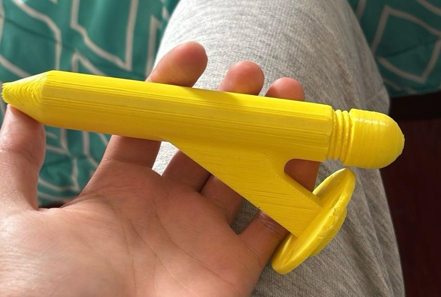

A continuación una foto del modelo final desarrollado en inventor con mejor ajuste de tolerancia y una mayor resistencia.

Plano de la herramienta que también se encuentran en este repositorio (docs\herramienta)
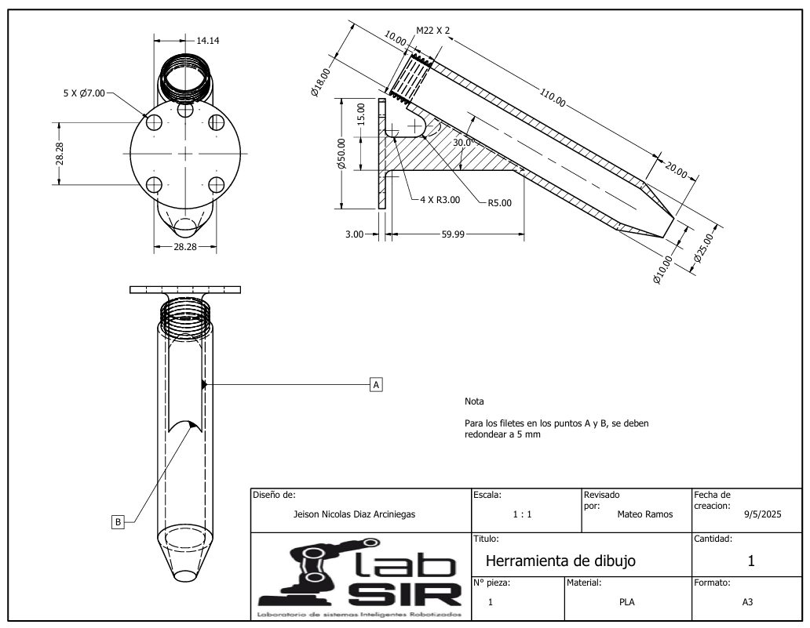

Foto de la herramienta montada en el robot.
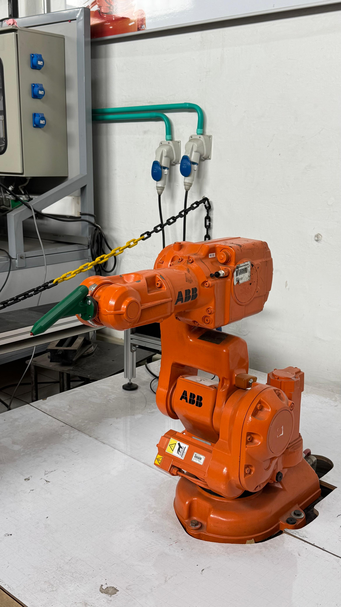

## Calibración
El proceso de calibración del robot con la herramienta nos tomó varias sesiones de práctica libre, inicialmente, nos daba un error de aproximadamente 30 o 40 milimetros, lo cual es demasiado teniendo en cuenta la toleracia de nuestra herramienta, sin embargo, en la tercera sesión ya con la práctica adquirida logramos tener un error de 2.44mm aproximadamente, lo cual es acorde a nuestra toleracia física de 3mm de nuestra herramienta mencionada en la sección anterior. 

A continuación la foto de la herramienta Tool_JM en la pantalla del Flex Pendant. 
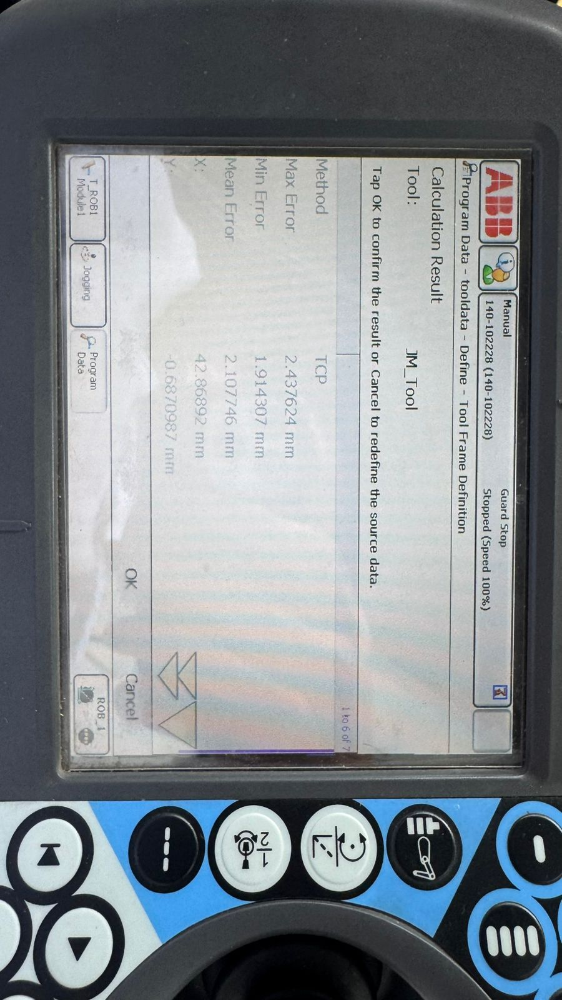
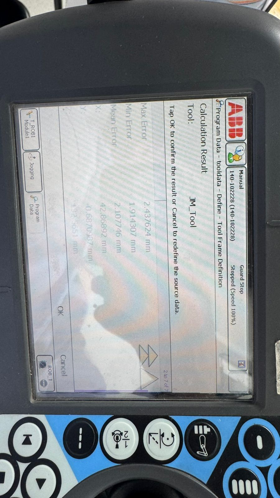

## Simulación
Respecto al manejo de Robot Studio, tuvimos que comenzar por importar los modelos cad tanto de la herramienta (es decir nuestro tool)como del workobject (el pastel). Configuramos nuestro tool dandole la orientacion al eje coordenado y ubicandolo en nuestro robot. Para el Work Object tambien es importante mencionar que grabamos nuestros nombres y el logo que ibamos a recrear en Robot Studio en Inventor para luego ubicar los Targets de manera más fácil Como se ve en la siguiente imagen.

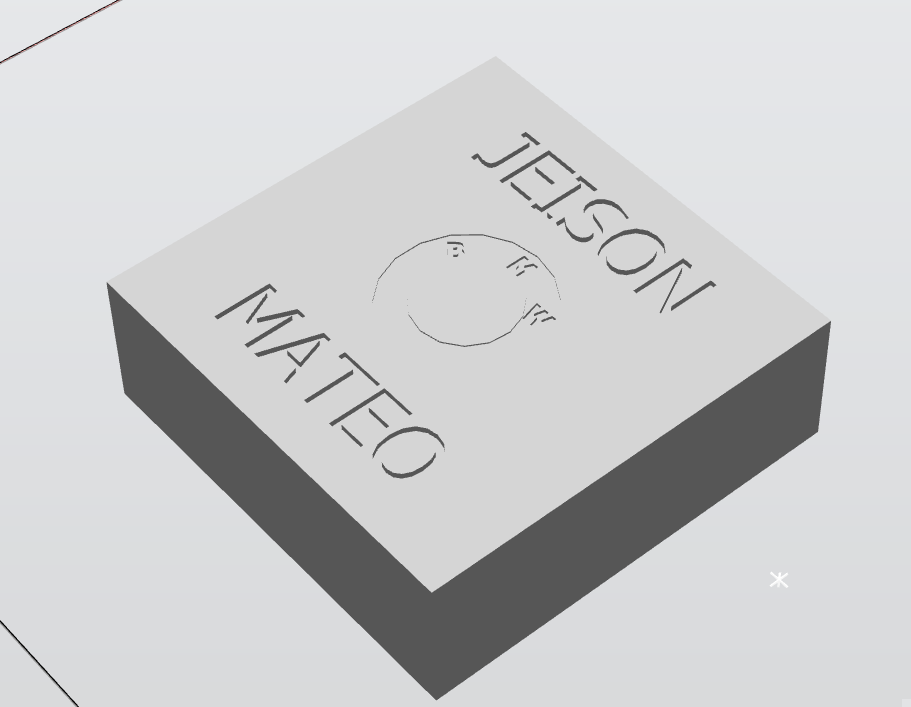

Una vez configurada la herramienta y el posicionado el workobject en el lugar que debería estar según el espacio de trabajo en el laboratorio en la banda transportadora, se comenazaron a crear los Targets, es decir los puntos que debían guiar al robot. 
Configurados los Targets, se crearon los Paths entre los Targets, es decir, los caminos que debía seguir el robot para hacer el dibujo. Aquí es importante resaltar la importancia de crear bien los Targets, pues se debía alzar el brazo cada vez que se deseaba alcanzar una posición diferente dentro del workobject, de otra manera se pintarían lineas indeseadas. TTambién se tuvo que utilizar diferentes comandos para hacer las lineas curvas o circulos, la instrucción MoveJ realiza desplazamientos rápidos por trayectorias curvas entre puntos mediante el movimiento coordinado de las articulaciones; MoveL mueve la herramienta en línea recta garantizando precisión en trayectorias como líneas o figuras; y MoveC permite describir trayectorias circulares o arcos suaves entre dos posiciones intermedias.

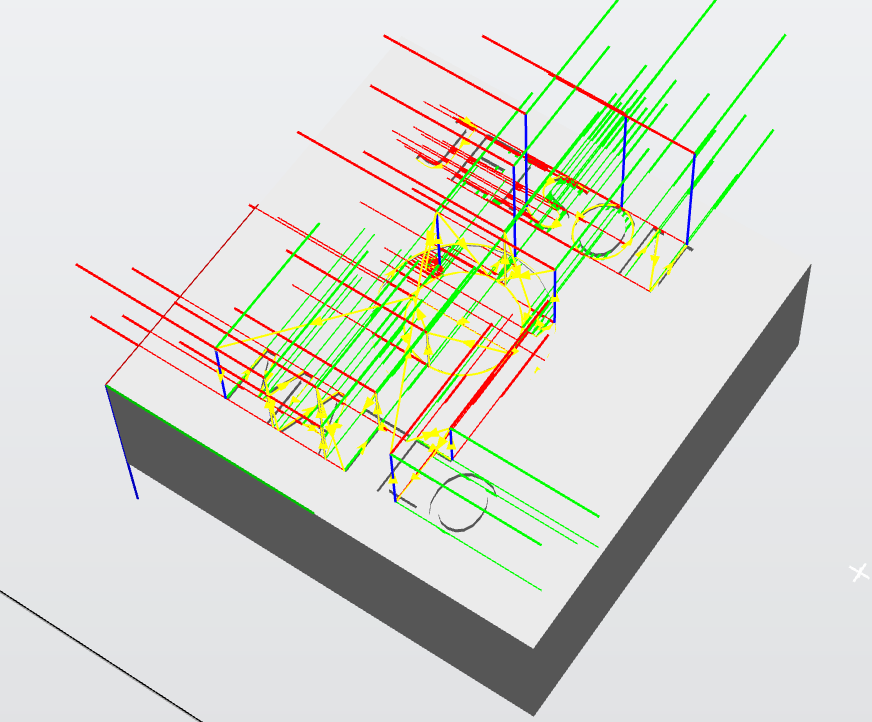

En la imagen se observan todos los sistemas coordenados (orientados en la misma dirección) de los Targets creados junto con los Paths que debía seguir el robot (las líneas amarillas). 

Una vez hechos los Paths y los Targets se sincronizó la estación con el código para poder ajustar el código de rapid de manera que la simulación sirviera. Importante tener en cuenta que estuvieran creados tanto los Target como los Paths en el código. (El código se encuentra adjunto en este repositorio en la ruta code\rapid\lab01_main.mod)

A continuación el diagrama de flujo del código final.
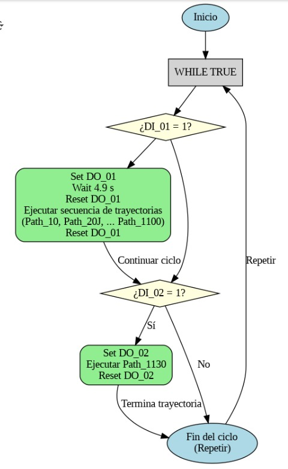

A continuación el plano de planta en el programa Robot Studio
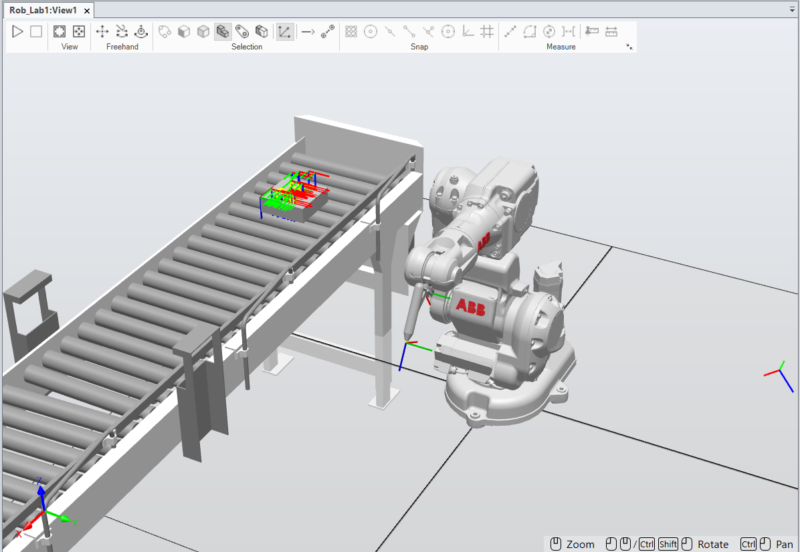

A continuación la simulación en Robot Studio.
[Ver video de simulación](videos/simulacion.mp4)

## Salidas y entradas digitales
Resp

## Implementación
Respecto a la implementación, tuvimos que comunicarnos con el controlador a través de un cable UTP para poder utilizar nuestra rutina, en principio, el reto fue lograr calibrar en el espacio de trabajo el WorkObject para que el robot fuera preciso en llegar y hacer la figura en nuestro WorkObject de la vida real, el cual, como el modelo CAD que hicimos, era una caja de 20x20x5cm.
Después de iterar varias veces, logramos ajustar con precision el robot con el WorkObject y ejecutamos la rutina teneindo en cuenta las salidas y entradas digitales también. 

A continuación el plano de planta en el laboratorio
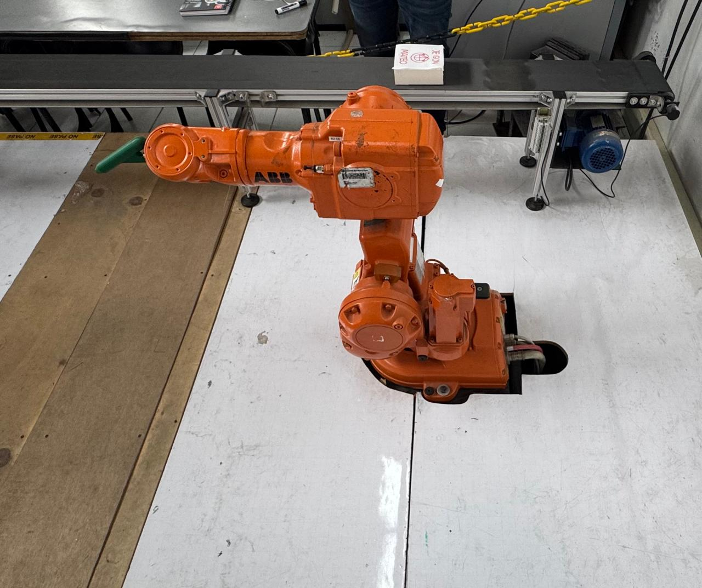

Por último el video final de la implementación completa
[Descargar video de implementación final](videos/demostración_final.mp4)

A continuación se puede ver en mejor detalle el dibujo final.
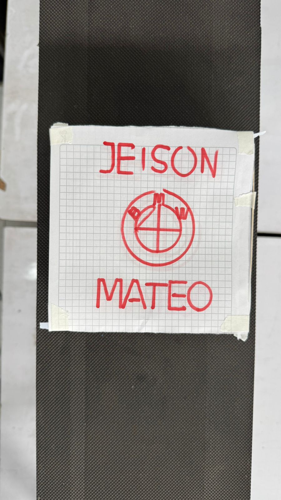

## Conclusiones y trabajo futuro

